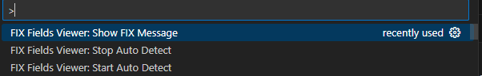
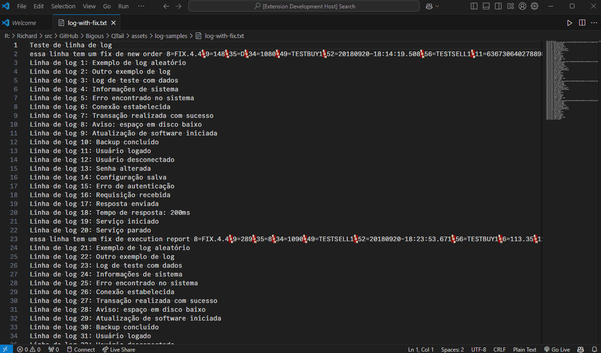
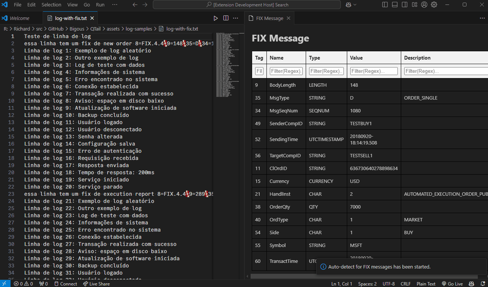

# fix-fields-viewer README

Shows a human readable and filterable view of the fields FIX protocol format inside a text file.

## Features

- Shows a human readable and filterable view of the fields FIX protocol format inside a text file.

We have 3 commands:

- `Fix Fields Viewer: Show Fix Message` - Shows the fix fields in the line where the cursor is positioned.

- `Fix Fields Viewer: Start Auto Detect` - Shows the fix fields in the line where the cursor is positioned and when you move the cursor to another line that has a fix message it updates the table.

- `Fix Fields Viewer: Stop Auto Detect` - Stops the auto detect feature.

## Requirements

No requirements are needed. For now it's not possible to customize the FIX Dictionary. It's using the default one from B3. You can find it [here](https://www.b3.com.br/en_us/solutions/platforms/puma-trading-system/for-developers-and-vendors/entrypoint-order-entry/).

## Extension Settings

This extension contributes the following settings:

* `fix-fields-viewer.autoDetect`: Enable/disable Autodetect fix line when activated.
* `fix-fields-viewer.keepFilters`: When enabled, the filters will be kept when the table is updated.

## Known Issues

## Release Notes

### 0.0.1

Initial release ...
